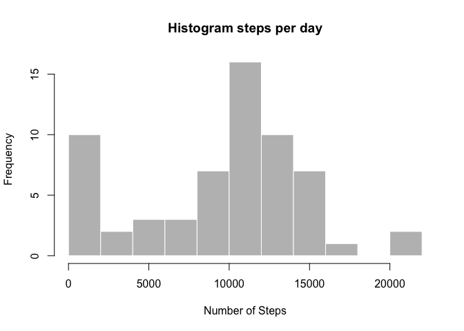
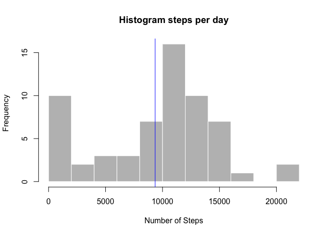
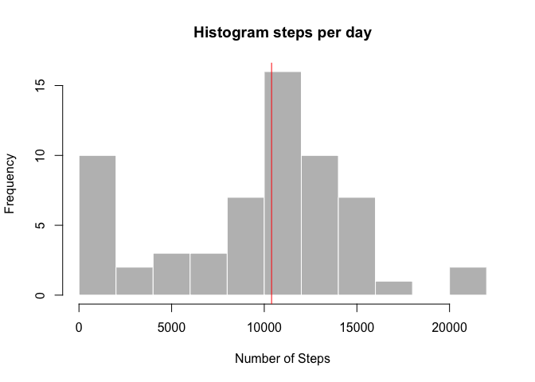
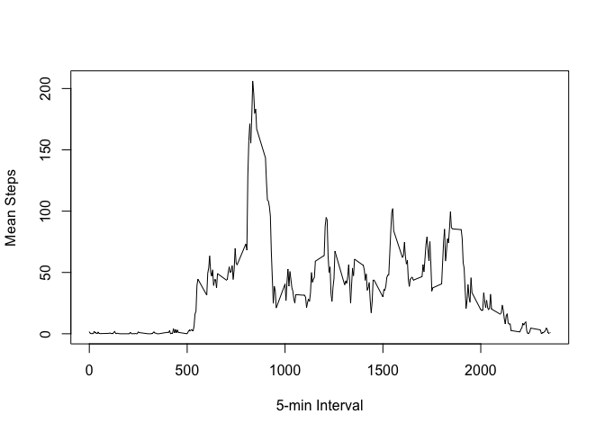
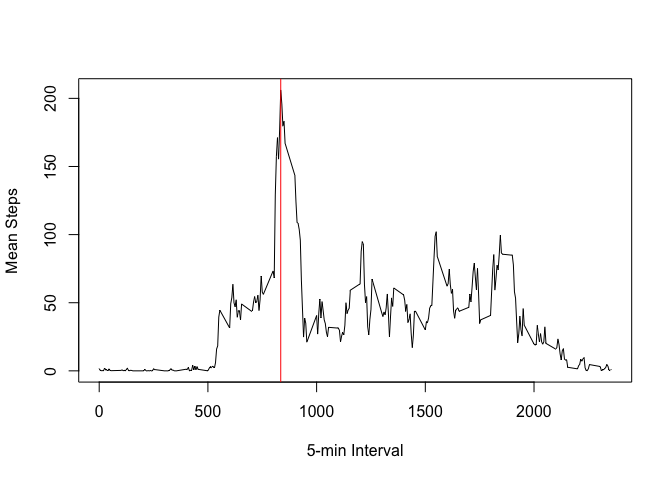
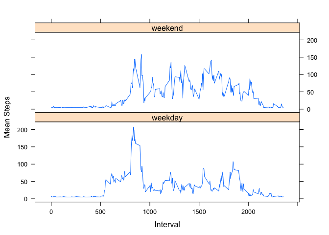

Loading and preprocessing the data
----------------------------------

Setup environment in English

    Sys.setlocale("LC_TIME", "C")

    ## [1] "C"

### 1. Load the data

    activity_data = read.csv("activity.csv", header=TRUE)

### 2. Check data structure

The variables included in this dataset are:

-   **steps**: Number of steps taking in a 5-minute interval (missing
    values are coded as *NA*)
-   **date**: The date on which the measurement was taken in YYYY-MM-DD
    format
-   **interval**: Identifier for the 5-minute interval in which
    measurement was taken

<!-- -->

    names(activity_data)

    ## [1] "steps"    "date"     "interval"

The dataset is stored in a comma-separated-value (CSV) file and there
are a total of 17,568 observations in this dataset.

    str(activity_data)

    ## 'data.frame':    17568 obs. of  3 variables:
    ##  $ steps   : int  NA NA NA NA NA NA NA NA NA NA ...
    ##  $ date    : Factor w/ 61 levels "2012-10-01","2012-10-02",..: 1 1 1 1 1 1 1 1 1 1 ...
    ##  $ interval: int  0 5 10 15 20 25 30 35 40 45 ...

    head(activity_data)

    ##   steps       date interval
    ## 1    NA 2012-10-01        0
    ## 2    NA 2012-10-01        5
    ## 3    NA 2012-10-01       10
    ## 4    NA 2012-10-01       15
    ## 5    NA 2012-10-01       20
    ## 6    NA 2012-10-01       25

### 3. Process/transform the data

Convert the date column to Date format

    activity_data$date = as.Date(activity_data$date, "%Y-%m-%d")

What is mean total number of steps taken per day?
-------------------------------------------------

### Calculate the total number of steps taken per day

Summarize the data (i.e. calculate the number of steps per day)

    activity_data_summary = aggregate(activity_data["steps"], by=activity_data["date"], FUN=sum, na.rm=TRUE)

### Make a histogram of the total number of steps taken each day

    hist(activity_data_summary$steps, 
         main="Histogram steps per day", 
         xlab="Number of Steps", 
         border="white", 
         col="grey",
         breaks=10)

  
 \#\#\# Calculate and report the mean and median of the total number of
steps taken per day

Mean steps per day

    mean_steps = mean(activity_data_summary$steps)
    hist(activity_data_summary$steps, 
         main="Histogram steps per day", 
         xlab="Number of Steps", 
         border="white", 
         col="grey",
         breaks=10)
    abline(v=mean_steps, col="blue")

  
 Median steps per day

    median_steps = median(activity_data_summary$steps)
    hist(activity_data_summary$steps, 
         main="Histogram steps per day", 
         xlab="Number of Steps", 
         border="white", 
         col="grey",
         breaks=10)
    abline(v=median_steps, col="red")

  

What is the average daily activity pattern?
-------------------------------------------

Time series plot of the 5-minute interval (x-axis) and the average
number of steps taken, averaged across all days (y-axis)

    daily_pattern = aggregate(activity_data["steps"], by=activity_data["interval"], FUN=mean, na.rm=TRUE)
    plot(daily_pattern$interval, daily_pattern$steps, type="l", xlab="5-min Interval", ylab="Mean Steps")

  
 5-minute interval which contains maximum number of steps

    max_mean_interval = max(daily_pattern$steps); max_mean_interval

    ## [1] 206.1698

    max_interval = daily_pattern[which(daily_pattern$steps == max_mean_interval), ]$interval
    plot(daily_pattern$interval, daily_pattern$steps, type="l", xlab="5-min Interval", ylab="Mean Steps")
    abline(v=max_interval, col="red")

  
 \#\# Imputing missing values

### Calculate and report the total number of missing values in the dataset

    sum(is.na(activity_data$steps))

    ## [1] 2304

### Devise a strategy for filling in all of the missing values in the dataset and create a new dataset that is equal to the original dataset but with the missing data filled in

    activity_data = transform(activity_data, steps = ifelse(is.na(steps), mean(steps, na.rm=TRUE), steps))
    activity_data_summary = aggregate(activity_data["steps"], by=activity_data["date"], FUN=sum, na.rm=TRUE)
    hist(activity_data_summary$steps, 
         main="Histogram steps per day", 
         xlab="Number of Steps", 
         border="white", 
         col="grey",
         breaks=10)

  
 \#\# Are there differences in activity patterns between weekdays and
weekends?

### Create a new factor variable in the dataset with two levels - "weekday" and "weekend" indicating whether a given date is a weekday or weekend day.

    activity_data$dayofweek = weekdays(activity_data$date)
    isWeekend = (activity_data$dayofweek %in% c("Saturday","Sunday"))
    activity_data$typeofday = factor (isWeekend, labels = c("weekday","weekend"))
    daily_pattern_2 = aggregate(activity_data["steps"], by = activity_data[c("interval", "typeofday")], FUN=mean, na.rm=TRUE)
    str(daily_pattern_2)

    ## 'data.frame':    576 obs. of  3 variables:
    ##  $ interval : int  0 5 10 15 20 25 30 35 40 45 ...
    ##  $ typeofday: Factor w/ 2 levels "weekday","weekend": 1 1 1 1 1 1 1 1 1 1 ...
    ##  $ steps    : num  7.01 5.38 5.14 5.16 5.07 ...

### Make a panel plot containing a time series plot (i.e. type = "l") of the 5-minute interval (x-axis) and the average number of steps taken, averaged across all weekday days or weekend days (y-axis).

    library(lattice)
    xyplot(steps ~interval | typeofday, data = daily_pattern_2,
          type = 'l',
          xlab = 'Interval',
          ylab = 'Mean Steps',
          layout = c(1,2))

